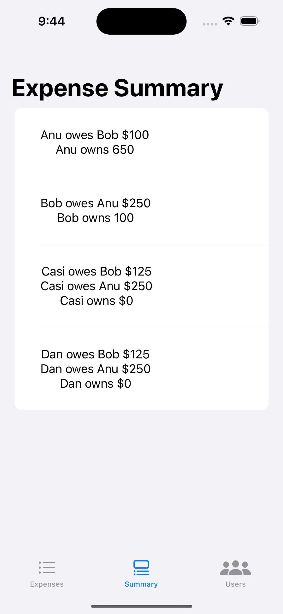

    

# SplitBillApp

## Introduction
SplitBillApp is an application to demonstrate the task of Splitting the bill between users a code challenge which has solved in the MVVM architecture integrated into SwiftUI App

SplitBillApp has following features
1. Expense List View
2. Add new Expense View
3. Expense Summary View
4. User List View
5. Add new User View

So all the above screens has split into mainly three tabs like Expenses, Summary and Users

## Steps for Running
1. Clone the code from the repo
2. Run the app in Xcode (Preferrably Xcode 14)
3. Launch the app
4. Go to Users Tab to add New Users
5. Go to Expenses Tab to add New Expenses (By Tapping on `+` icon on the top right)
    1. Enter the Name of Expense (Anything like Rent/ Gas/ Shopping)
    2. Enter the bill amount
    3. Choose who has settled from the menu
    4. Choose the user with whom the bill has to be splitted
    5. Tap Save
6. Added expense should be displayed with the given details
7. Repeat the same steps to add 2 more expenses
8. Switch to Summary Tab to see the summary details of how much each user owes other person in Total and also Finally how much each user owns. 

## Architecture
App is powered by Combine, SwiftUI using the MVVM pattern. All the UI's are powered with @State and @ObservedObject property wrappers and the view models were injected from the top level app to access across the app.

### Repositories
Since we're not using any APIs it will persist data within user defaults and it will store and retrieve in the form of Data with the help of Codables it will transformed to respective Model

### Combine
All the data bindings and state property warappers under the hood uses the powerful framework Combine

### Dependency Injection
Purpose of enabling the more testable business logic dependency has injected into the view model to help creating the mock service during the test case execution.

E.g Repository dependency has injected into the view model as an abstract instead of direct concrete type hence during the testing we can create a mock repository and return the results of our choice the same applies to network repository if we're connecting

### Testing
> At this time, there are no real test cases present for the timebeing but the provisions were added for injecting the dependencies.